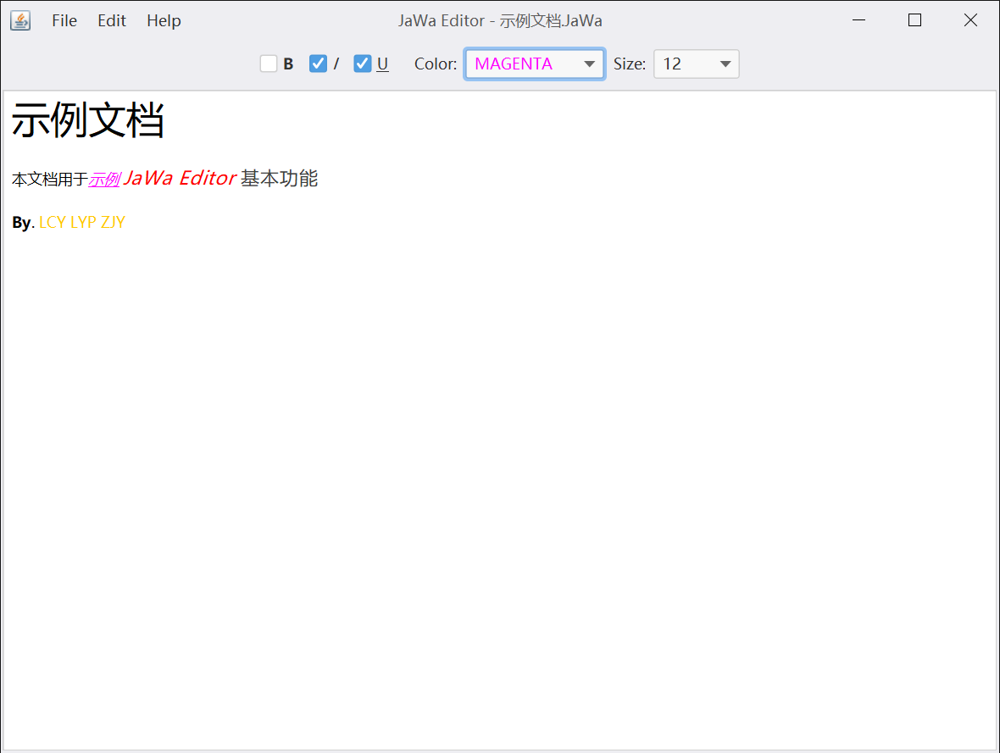

# JaWaEditor
An assignment for the Java programming course held by XJTU.

## Contributors

| Name          |
| ------------- |
| Junyang Zhang |
| Chenyang Li   |
| Yupei Li      |

## Enviroment

Jetbrains Intellij Idea is recommended as the IDE of this Gradle project.

The JDK 15 is preferred, but it shall also be compatible with JDK 8.

## Project report

This project aims to implement a text editor in Java, please view [the report](Report/Report.md) for details.

